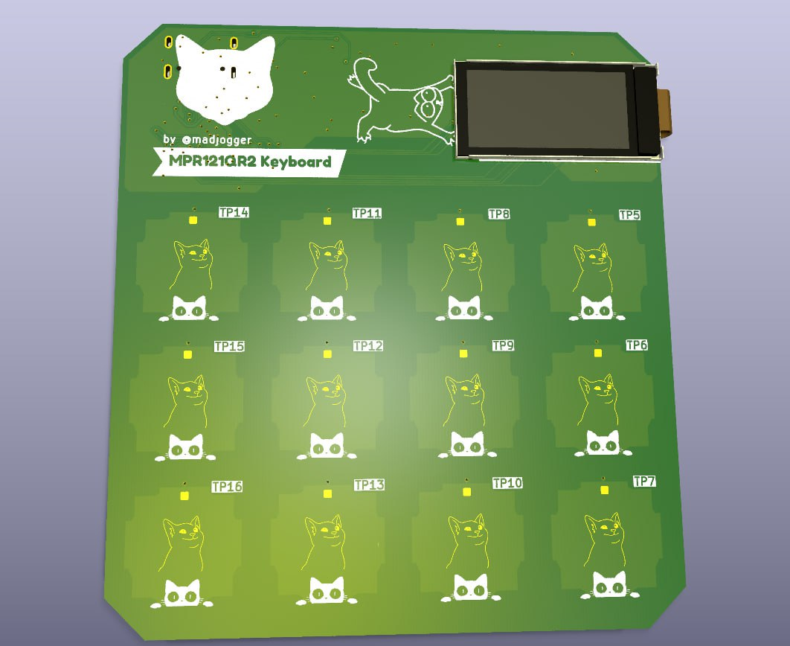

# MPR121QR2_Keyboard

**Мини-клавиатура на 12 сенсорных кнопок: ёмкостный драйвер MPR121QR2, контроллер RP2040 и цветной дисплей ST7735.**

Компактная плата сенсорной клавиатуры на базе контроллера касаний **MPR121QR2** (NXP), обслуживающего 12 ёмкостных кнопок по I²C. Логику и обработку берёт на себя **RP2040**, для индикации установлен дисплей **0.96" ST7735**, а на борту есть узел измерения тока. Завершающая плата небольшой серии проектов на RP2040.

## Обзор

- **Название проекта:** MPR121QR2_Keyboard
- **Контроллер касаний:** NXP MPR121QR2 — 12-канальный ёмкостный сенсор (I²C)
- **Микроконтроллер:** Raspberry Pi RP2040 (двухъядерный Cortex-M0+)
- **Дисплей:** 0.96" ST7735 (цветной TFT, SPI)
- **Доп. функция:** измерение тока на плате
- **Назначение:** сенсорная клавиатура / ввод касанием, эксперименты с ёмкостными кнопками

## Ключевые особенности

- **12 ёмкостных кнопок** — MPR121QR2 обслуживает до 12 сенсорных электродов с автоконфигурацией и настраиваемыми порогами
- **I²C-интерфейс + IRQ** — компактное подключение, прерывание по событию касания
- **RP2040** — двухъядерный Arm Cortex-M0+ до 133 МГц, обработка касаний и вывод на дисплей
- **Цветной дисплей 0.96" ST7735** — индикация состояния кнопок и данных по SPI
- **Измерение тока** — узел контроля потребления на плате
- **Доступная элементная база** — MPR121 широко доступен, готовый модуль с ним стоит около 100 руб, так что решение легко повторить

## Что на плате

| Блок | Компонент | Назначение |
|---|---|---|
| Контроллер касаний | MPR121QR2 | 12 ёмкостных кнопок по I²C |
| Микроконтроллер | RP2040 | Обработка касаний, логика, вывод на дисплей |
| Дисплей | 0.96" ST7735 | Цветной TFT-индикатор (SPI) |
| Измерение тока | узел токового контроля | Замер потребления |
| Интерфейс | USB | Питание и связь с хостом |

## Технические характеристики

| Параметр | Значение |
|---|---|
| Контроллер касаний | NXP MPR121QR2, 12 электродов |
| Интерфейс сенсора | I²C (до 400 кГц) + линия IRQ |
| Микроконтроллер | RP2040, 2× Cortex-M0+ до 133 МГц |
| Дисплей | 0.96" ST7735, цветной TFT, SPI |
| Измерение тока | встроенный узел |
| Питание | USB / 3.3 В |

## Применение

- Сенсорная клавиатура / панель ввода касанием
- Изучение ёмкостных кнопок и контроллера MPR121
- Компактный пользовательский интерфейс с индикацией на дисплее
- Учебная/макетная плата на RP2040

## Среда разработки

- **Схема и плата:** KiCad
- **Прошивка:** PlatformIO / Arduino / Pico SDK (RP2040)
- **Документация на компоненты:** datasheet MPR121 (NXP), RP2040 (Raspberry Pi), ST7735
